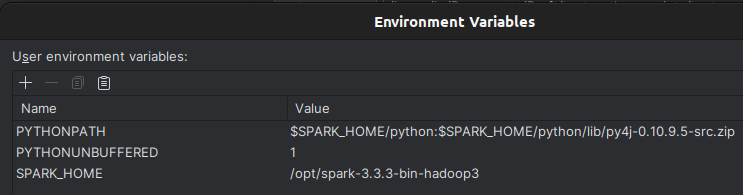
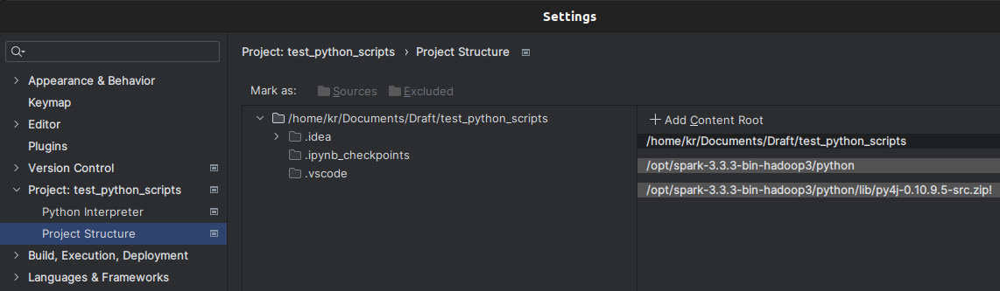

# Context 
## History
Initially developed by the University of California, Spark is an 
open-source ``unified analytics engine for large-scale data processing``, 
its code base has been donated to Apache Software Foundation that  
maintains it since.\
Spark provides clusters with implicit ``data parallelism`` and ``fault tolerance``.

## Overview
Spark's architectural foundation is in ``Resilient Distributed Dataset 
(RDD)``, a read-only multi-set distributed over a cluster of machines 
which is organized in a fault tolerance way.\
The ``Dataframe API`` was released as an abstraction on top of the RDD, 
as of Spark 2.x ``Dataset API`` is encouraged.\
Spark and its RDDs were developed to overcome the MapReduce cluster 
computing paradigm forcing a particular linear dataflow structure on 
distributed programs.\
Apache Spark workflow  is managed as Directed Acyclic Graph, nodes 
representing RDDs while edges represent the operations on the RDDs.\
Spark facilitates the implementation of both iterative algorithms and 
interactive/exploratory data analysis.\
The latency of such applications may be reduced by several orders of 
magnitude compared to Apache Hadoop MapReduce implementation.

### Spark Core
A driver program invokes parallel operations such as map, filter or reduce
on an RDD.\
These operations and some others like join take RDDs as input and create 
new RDDs. RDDs are immutable and their operations are lazy, 
fault-tolerance is achieved by keeping track of the lineage of each RDD 
(the sequence of operations that produce it).

## Spark SQL
It is a component on top of Spark Core that introduced a data abstraction 
called DataFrames.

## Spark Streaming
It ingests data in a mini-batches, and perform RDD transformations on 
those mini-batches

## Spark MIlib
It is a distributed machine-learning framework on top of Sparke Core that
is much faster that the disk-based implementation.

## GraphX
It is a distributed graph-processing framework on top of Apache Spark. 
As it based on RDDs, being immutable, GraphX is unsuitable for grpahs that
need to be updated.

# Installation
- Select and download the desired version in the below links:
    - [Hadoop Apache page](https://hadoop.apache.org/releases.html)
    - [Download Apache Spark page](https://spark.apache.org/downloads.html) 
- Install/Unzip the downloaded files
- For Linux add for example in bashrc:
    ```bash
    # Hadoop
    export HADOOP_HOME="/opt/hadoop-3.3.6"
    export LD_LIBRARY_PATH="$HADOOP_HOME/lib/native" 

    # Spark
    export SPARK_VERSION=3.3.3  # useful to use library like pydeequ
    export SPARK_HOME="/opt/spark-3.3.3-bin-hadoop3"
    export PATH="$PATH:$SPARK_HOME/bin:$SPARK_HOME/sbin"
    export PYSPARK_PYTHON=~/miniconda3/envs/data_cleaning/bin/python
    ```
- To use it in *jupyter notebook*
    - download the package ``findspark``
    - then 
        ```python
        import findspark  # package to access spark installation 
        findspark.init()  # locate spark , thanks to SPARK_HOME
        ```
- Some extra steps to use in *Pycharm*
    - in the config file set ``PYTHONPATH`` and ``SPARK_HOME``:
    
    - in the project structure add the below 2 last paths:
    

