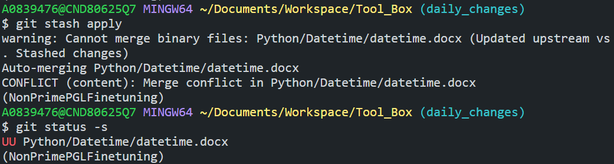
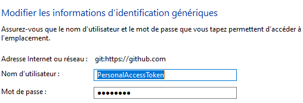

- [1) Basics](#1-basics)
  - [a. Import remote branch](#a-import-remote-branch)
  - [b. Browse history](#b-browse-history)
  - [c. Compare files](#c-compare-files)
    - [1) Compare files from local and remote](#1-compare-files-from-local-and-remote)
    - [2) Compare file unstaged file against the last committed files](#2-compare-file-unstaged-file-against-the-last-committed-files)
    - [3) Compare version](#3-compare-version)
  - [d. Read the version of a given commit/branch](#d-read-the-version-of-a-given-commitbranch)
  - [e. Keep color](#e-keep-color)
- [2) Know where config is stored](#2-know-where-config-is-stored)
- [3) Perform changes](#3-perform-changes)
  - [a. Delete a change or a branch](#a-delete-a-change-or-a-branch)
  - [b. Rename branch](#b-rename-branch)
  - [c. Stashing](#c-stashing)
  - [d. Merge](#d-merge)
  - [e. Unmerged conflicts](#e-unmerged-conflicts)
- [4) Review history](#4-review-history)
  - [a. Change commits](#a-change-commits)
- [5) Credentials](#5-credentials)
  - [Windows (Personal Access Token)](#windows-personal-access-token)
  - [SSH (Secure SHell protocol)](#ssh-secure-shell-protocol)

## 1) Basics
### a. Import remote branch
````bash
git checkout –track name_of_the_remote_branch  # create a tracking branch 
````

### b. Browse history
````bash
git log --patch -2  # Display the differences resulting of committed changes. -2 restrict the displaying of logs to 2. 
git log --stat  # Summarize the above command line in number of insertions/deletions by file
git log  --pretty=format:'%h - %an %ad %s' --graph  # Get the some information here the references as graph
````


````bash
git log -- path  # display filtered log inside path
````


### c. Compare files
#### 1) Compare files from local and remote
````bash
git fetch remote_branch
git diff local_branch remote_branch --path_file
````
#### 2) Compare file unstaged file against the last committed files
````bash
git difftool HEAD --path_file
git difftool HEAD:path_file_1 path_file_2  # compare 2 different files
````

#### 3) Compare version
````bash
git ls-files -m                            # list the unstaged modified files
git diff --name-only SHA1 SHA2
````
### d. Read the version of a given commit/branch
````bash
git rev-parse name_branch  # get the hash code of the branch/commit
git cat-file -p SHA1:./path_file
````
### e. Keep color
````bash
git <command> --color=always | less -r  # first argument to encode color even in pipeline, second one to interpret the encoded color
````
## 2) Know where config is stored

``git config --list --show-scop e`` To get the hierarchy at which a given Git configuration
occured.

To get as well the file in which the different configurations have been set replace ``scope``
with ``origin``.

## 3) Perform changes 
### a. Delete a change or a branch
````bash
git restore <path_file>  # remove added file before committing
git branch -d name_branch_to_delete  # remove branch only if it is fully merged
git push origin --delete <name_branch>  # delete branch on server
````
### b. Rename branch  
````bash
git branch -m new_name  # on the branch that we want to rename
git branch -m old_name new_name  # from another branch that the one to rename
git push origin :old_name new_name  # delete the old_name remote branch an push new_name
git push origin -u new_name  # reset the upstream branch for the new_name local branch
````

### c. Stashing
````bash
git stash push -m 'Message associated with stash'
git stash list --date=local # to access to the stash list with date
git stash apply # apply the more recent stash (stash@{0})
git stash apply stash@{2} # apply the third more recent stash
git stash drop stash@{1} # remove the second more recent stash
````

### d. Merge
````bash
git switch branch_merge_into  # move to the branch in which we want to perform changes
git merge branch_merge_from   # perform the merge in providing the name of the branch from where we want to get data.
git restore --source stash@{0} --patch -- path/file/for_merge  # allows to merge file <path/file/for_merge> from stash@{0} into HEAD
````

### e. Unmerged conflicts

````bash
git restore --staged  # restore the index
````

## 4) Review history
### a. Change commits
````bash
git rebase -i HEAD~n  # with n the depth of the past commits
````
Then a window containing the different commit names and the option that can be used on them will be displayed.
For example we can **drop** a given commit.

## 5) Credentials

### Windows (Personal Access Token)
- On GitHub profile go to *settings* > *Developper settings* > *Personal access tokens* > 
  *Tokens (classic)*
- Then click on **Generate new token** copy the content in a safe place.
- Afterward fill the password with the token value previously copied:
  - 
  - 
- In at least at the local scale be sure that ``credential.helper=manager``, otherwise active it:
  ````bash
  git config credential.helper manager  # to apply it to all repositories add <--global> after <config>
  ````

### SSH (Secure SHell protocol)
- On GitHub profile go to *settings* > *SSH and GPG keys* 
- Then add the private key created on the PC that we want to connect to the repository
