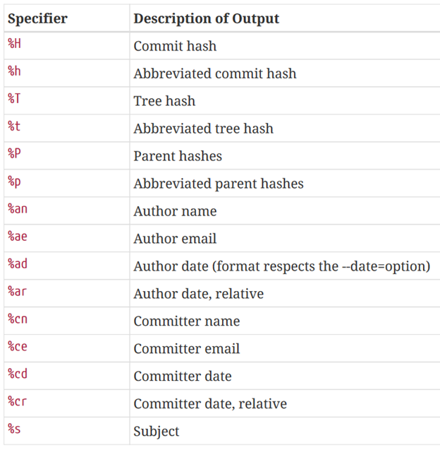
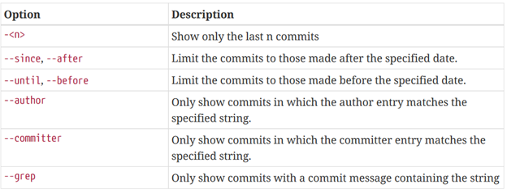
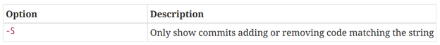
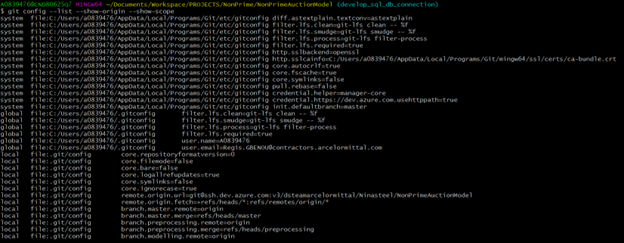
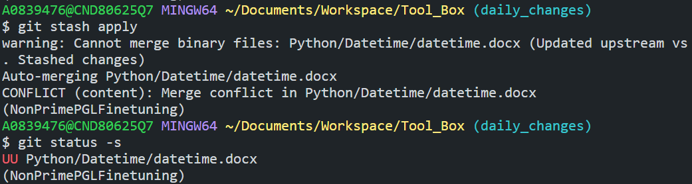
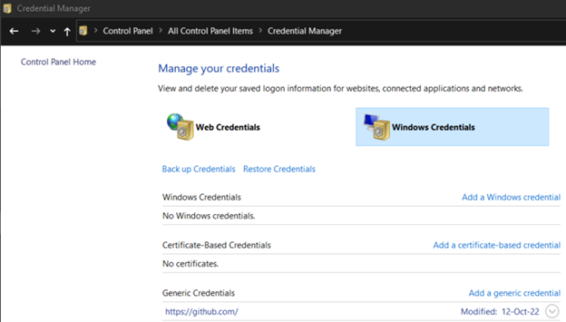
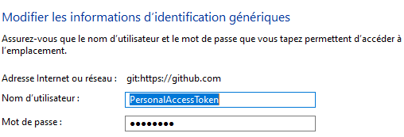

- [1) Basics](#1-basics)
  - [a. The different states of the code](#a-the-different-states-of-the-code)
  - [b. Import remote branch](#b-import-remote-branch)
  - [c. Browse history](#c-browse-history)
  - [d. Compare files](#d-compare-files)
    - [1) Compare files from local and remote](#1-compare-files-from-local-and-remote)
    - [2) Compare file unstaged file against the last committed files](#2-compare-file-unstaged-file-against-the-last-committed-files)
    - [3) Compare version](#3-compare-version)
  - [e. Read the version of a given commit/branch](#e-read-the-version-of-a-given-commitbranch)
  - [f. Keep color](#f-keep-color)
  - [g. Untrack file](#g-untrack-file)
  - [h. Inspect remote branches](#h-inspect-remote-branches)
- [2) Know where config is stored](#2-know-where-config-is-stored)
- [3) Perform changes](#3-perform-changes)
  - [a. Delete a change or a branch](#a-delete-a-change-or-a-branch)
  - [b. Rename or create branch](#b-rename-or-create-branch)
  - [c. Stashing](#c-stashing)
  - [d. Merge](#d-merge)
  - [e. Unmerged conflicts](#e-unmerged-conflicts)
  - [f. Commit only relevant changes across multiple ones](#f-commit-only-relevant-changes-across-multiple-ones)
- [4) Review history](#4-review-history)
  - [a. Change commits](#a-change-commits)
  - [b. Squash commits](#b-squash-commits)
  - [c. Use branch from a repository A to create on in a repository B](#c-use-branch-from-a-repository-a-to-create-on-in-a-repository-b)
- [5) Credentials](#5-credentials)
  - [Windows (Personal Access Token)](#windows-personal-access-token)
  - [SSH (Secure SHell protocol)](#ssh-secure-shell-protocol)
- [6) Change configuration](#6-change-configuration)


## 1) Basics

### a. The different states of the code
```
                    LOCAL ENVIRONMENT                         │  REMOTE
                                                              │
  ┌───────────────┐      ┌───────────────┐    ┌─────────────┐ │ ┌─────────────┐
  │   Workspace   │      │    Staging    │    │    Local    │ │ │   Remote    │
  │  (Working     │      │     Area      │    │ Repository  │ │ │ Repository  │
  │  Directory)   │      │    (Index)    │    │             │ │ │             │
  └───────┬───────┘      └───────┬───────┘    └──────┬──────┘ │ └──────┬──────┘
          │                      │                   │        │        │
          │  git add/mv/rm       │                   │        │        │
          │─────────────────────►│                   │        │        │
          │                      │                   │        │        │
          │                      │   git commit      │        │        │
          │                      │──────────────────►│        │        │
          │                      │                   │        │        │
          │       git commit -a (bypass staging)     │        │        │
          │─────────────────────────────────────────►│        │        │
          │                      │                   │        │        │
          │  git restore <file>  │                   │        │        │
          │◄─────────────────────│                   │        │        │
          │                      │                   │        │        │
          │       git restore --staged <file>        │        │        │
          │◄─────────────────────────────────────────│        │        │
          │                      │                   │        │        │
          │                      │                   │  git push       │
          │                      │                   │────────────────►│
          │                      │                   │        │        │
          │                      │                   │  git fetch      │
          │                      │                   │◄────────────────│
          │                      │                   │        │        │
          │           git clone / git pull           │        │        │
          │◄─────────────────────────────────────────────────────────  │
          │                      │                   │        │        │
          │◄────────────────────►│                   │        │        │
          │      git diff        │                   │        │        │
          │                      │                   │        │        │
          │◄────────────────────────────────────────►│        │        │
          │              git diff HEAD               │        │        │
  ┌───────┴───────┐      ┌───────┴───────┐   ┌──────┴──────┐  │ ┌──────┴──────┐
  │   Workspace   │      │    Staging    │   │    Local    │  │ │   Remote    │
  └───────────────┘      └───────────────┘   └─────────────┘  │ └─────────────┘
                                                              │
                                              LOCAL/REMOTE boundary
```
Note that `HEAD` lives exclusively in *Local Repository* and by default points on the last 
commit, it's possible to *detached* it and point on an old commit.

### b. Import remote branch
````bash
git checkout –track name_of_the_remote_branch  # create a tracking branch 
````

### c. Browse history
````bash
git log --patch -2  # Display the differences resulting of committed changes. -2 restrict the displaying of logs to 2. 
git log --stat  # Summarize the above command line in number of insertions/deletions by file
git log  --pretty=format:'%d : %h : %an : %ad : %s' --graph --decorate=full  # Get the some information here the references as graph, %d for decorated display branch name, --decorate=full allows to display tags
````


````bash
git log -- path  # display filtered log inside path
````




### d. Compare files
#### 1) Compare files from local and remote
````bash
git fetch remote_branch
git diff local_branch remote_branch --path_file
````
#### 2) Compare file unstaged file against the last committed files
````bash
git difftool HEAD --path_file
git difftool HEAD:path_file_1 path_file_2  # compare 2 different files
````

#### 3) Compare version
````bash
git ls-files -m                            # list the unstaged modified files
git diff --name-only SHA1 SHA2
````
### e. Read the version of a given commit/branch
````bash
git rev-parse name_branch  # get the hash code of the branch/commit
git cat-file -p SHA1:./path_file
````
### f. Keep color
````bash
git <command> --color=always | less -r  # first argument to encode color even in pipeline, second one to interpret the encoded color
````

### g. Untrack file

````bash
git rm --cached file_to_ignore
````

### h. Inspect remote branches

````bash
git remote show origin  # displays the status of the remote branches, useful for cleaning, then encourage to use `git remote prune origin`
````
## 2) Know where config is stored

``git config --list --show-scope`` To get the hierarchy at which a given Git configuration
occurred.

To get as well the file in which the different configurations have been set replace ``scope``
with ``origin``.

## 3) Perform changes 
### a. Delete a change or a branch
````bash
git restore <path_file>  # remove added file before committing
git branch -d name_branch_to_delete  # remove branch only if it is fully merged
git push origin --delete <name_branch>  # delete branch on server
````
### b. Rename or create branch  
````bash
git switch -c name 
git branch --edit-description  # starts a inline editor to add comments about the current branch <name> 
git branch -m new_name  # on the branch that we want to rename
git branch -m old_name new_name  # from another branch that the one to rename
git push origin :old_name new_name  # delete the old_name remote branch an push new_name
git push origin -u new_name  # reset the upstream branch for the new_name local branch
````

### c. Stashing
````bash
git stash push -m 'Message associated with stash'
git stash list --date=local # to access to the stash list with date
git stash apply # apply the more recent stash (stash@{0})
git stash apply stash@{2} # apply the third more recent stash
git stash drop stash@{1} # remove the second more recent stash
````

### d. Merge
````bash
git switch branch_merge_into  # move to the branch in which we want to perform changes
git merge branch_merge_from   # perform the merge in providing the name of the branch from where we want to get data, to get only external changes use -Xtheirs if only base changes -Xours
git restore --source stash@{0} --patch -- path/file/for_merge  # allows to merge file <path/file/for_merge> from stash@{0} into HEAD
````

### e. Unmerged conflicts

````bash
git restore --staged  # restore the index
````

### f. Commit only relevant changes across multiple ones

````bash
git add -p  # open interactive editor to add desired patch of changed code (hunk) in `Staging` state
# y → stage this hunk
# n → skip this hunk
# s → split into smaller hunks
# q → quit
git commit -m "Message focus on relevant part of code that have been added in Staging state"
# Then feel free to handle the changes that did not have been added then committed in the way you want
````

## 4) Review history
### a. Change commits
````bash
git rebase -i HEAD~n  # with n the depth of the past commits
````
Then a window containing the different commit names and the option that can be used on them will be displayed.
For example we can **drop** a given commit.

### b. Squash commits
Imagine you want to squash different commit from your $current$ commit to your $n$ previous commit, the above command works, but you are likely to have to fix some
conflict issues.

### c. Use branch from a repository A to create on in a repository B

````bash
cd project_a
git format-patch main..HEAD --output-directory $TMP/patches  # put patches in $TMP
cd project_b
git switch -c new_branch  # pay attention from which branch you create this new one
git am --3way $TMP/patches/*.patch  # see the differences as conflicts otherwise it could be though to understand the differences, it is a 3 way merge (1. base version, 2.theirs, what we have in patches and 3. yours what we have in current files)
````
Note that you have to git rm <file> 


## 5) Credentials

### Windows (Personal Access Token)
- On GitHub profile go to *settings* > *Developper settings* > *Personal access tokens* > 
  *Tokens (classic)*
- Then click on **Generate new token** copy the content in a safe place.
- Afterward fill the password with the token value previously copied:
  - 
  - 
- In at least at the local scale be sure that ``credential.helper=manager``, otherwise active it:
  ````bash
  git config credential.helper manager  # to apply it to all repositories add <--global> after <config>
  ````

### SSH (Secure SHell protocol)
- On GitHub profile go to *settings* > *SSH and GPG keys* 
- Then add the private key created on the PC that we want to connect to the repository

## 6) Change configuration

````bash
git config --list --show-origin  # display all the configuration (system/global/local)
git config set --global init.defaultbranch=main main  # rename inital branch as 'main', this rule will be the default one of all repositories in the user profile
git config --global core.quotePath false  # prevent Git to use octal escape
````
