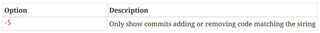

- [1) Basics](#1-basics)
  - [a. Import remote branch](#a-import-remote-branch)
  - [b. Browse history](#b-browse-history)
  - [c. Compare files](#c-compare-files)
    - [1) Compare files from local and remote](#1-compare-files-from-local-and-remote)
    - [2) Compare file unstaged file against the last committed files](#2-compare-file-unstaged-file-against-the-last-committed-files)
    - [3) Compare version](#3-compare-version)
  - [d. Read the version of a given commit/branch](#d-read-the-version-of-a-given-commitbranch)
- [2) Know where config is stored](#2-know-where-config-is-stored)
- [3) Perform changes](#3-perform-changes)
  - [a. Delete a change or a branch](#a-delete-a-change-or-a-branch)
  - [b. Rename branch](#b-rename-branch)
  - [c. Stashing](#c-stashing)
- [4) Review history](#4-review-history)
  - [a. Change commits](#a-change-commits)
- [5) Credentials](#5-credentials)

## 1) Basics
### a. Import remote branch
````git
git checkout –track name_of_the_remote_branch  # create a tracking branch 
````

### b. Browse history
````git
git log --patch -2  # Display the differences resulting of committed changes. -2 restrict the displaying of logs to 2. 
git log --stat  # Summarize the above command line in number of insertions/deletions by file
git log  --pretty=format:'%h - %an %ad %s' --graph  # Get the some information here the references as graph
````


````git
git log -- path  # display filtered log inside path
````




### c. Compare files
#### 1) Compare files from local and remote
````git
git fetch remote_branch
git diff local_branch remote_branch --path_file
````
#### 2) Compare file unstaged file against the last committed files
````git
git difftool HEAD --path_file
git difftool HEAD:path_file_1 path_file_2  # compare 2 different files
````

#### 3) Compare version
````git
git ls-files -m                            # list the unstaged modified files
git diff --name-only SHA1 SHA2
````
### d. Read the version of a given commit/branch
````git
git rev-parse name_branch  # get the hash code of the branch/commit
git cat-file -p SHA1:./path_file
````
## 2) Know where config is stored


## 3) Perform changes 
### a. Delete a change or a branch
````git
git restore <path_file>  # remove added file before committing
git branch -d name_branch_to_delete  # remove branch only if it is fully merged
git push origin --delete <name_branch>  # delete branch on server
````
### b. Rename branch  
````git
git branch -m new_name  # on the branch that we want to rename
git branch -m old_name new_name  # from another branch that the one to rename
git push origin :old_name new_name  # delete the old_name remote branch an push new_name
git push origin -u new_name  # reset the upstream branch for the new_name local branch
````

### c. Stashing
````git
git stash
git stash list # to access to the stash list
git stash apply # apply the more recent stash (stash@{0})
git stash apply stash@{2} # apply the third more recent stash
git stash drop stash@{1} # remove the second more recent stash
````

## 4) Review history
### a. Change commits
````git
git rebase -i HEAD~n  # with n the depth of the past commits
````
Then a window containing the different commit names and the option that can be used on them will be displayed.
For example we can **drop** a given commit.
## 5) Credentials
