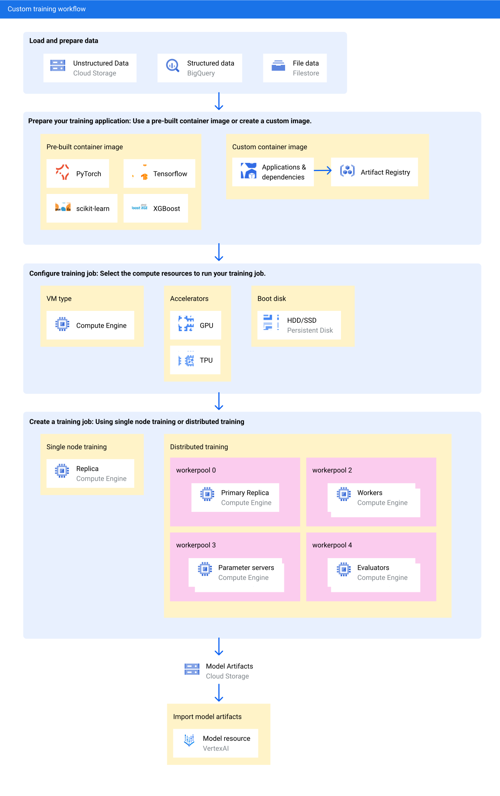

- [Google Cloud material](#google-cloud-material)
  - [Google Cloud CLI](#google-cloud-cli)
  - [``gcloud``](#gcloud)
- [Vertex AI](#vertex-ai)
  - [Introduction](#introduction)
  - [Vertex AI Workbench](#vertex-ai-workbench)
  - [BigQuery](#bigquery)
    - [In a few words](#in-a-few-words)
  - [Workflow](#workflow)
- [Cloud Storage Buckets](#cloud-storage-buckets)
  - [In summary](#in-summary)
  - [Commands](#commands)

# Google Cloud material

## Google Cloud CLI

To install the necessary material follow the instruction of the page: 
[https://cloud.google.com/sdk/docs/install#deb](https://cloud.google.com/sdk/docs/install#deb)

## ``gcloud``

- List projects
  ````bash
  gcloud projects list
  ````
- Create a new one
  ````bash
  gcloud projects create <project_id>  # <project_id> must be composed of lowercase alphanumerical characters and potentially '-', '_' or '.'
  ````
- Display the metadata for a project <project_id>
  ````bash
  gcloud projects describe <project_id>
  ````
- Searching for projects having a given feature
  ````bash
  gcloud alpha projects search --query="displayName=test*"  # display the list of project whose name starts with 'test'
  ````
-

# Vertex AI 

## Introduction

It is a **machine learning platform** allowing to:

- *train*
- *deploy*

Vertex AI provides several options:

- **AutoML**: letting the ability to train model on data (tabular, image, text...) 
without writing code
- **Custom training**: allowing to have the complete control over the training 
process 
- **Model Garden**: to discover, test, customize and deploy Vertex AI and select 
open-source models and assets
- **Generative AI**: to grant access to Google's large generative AI models for 
multiple modalities (text, code, images, speech)


## Vertex AI Workbench

It is a Jupyter notebook-based development environment for the entire data science 
workflow.\
It is packaged with JupyterLab and have preinstalled suite of deep learning packages 
and Tensorflow, Pytorch frameworks.

## BigQuery
### In a few words
It is a ``fully managed AI-ready data platform`` helping to manage and analyze data 
with built-in features like machine learning, search, geospatial  analysis etc...

## Workflow 



# Cloud Storage Buckets

## In summary

They are the basic containers holding the data. We can create as many buckets as we 
want, each bucket is associated with a unique **id-number** and a 
**geographic location**. It is relevant to enable the *hierarchical namespace* feature,
allowing to organize buckets in file system.\
Worth to know, bucket names must contain only lowercase characters with potentially '-', 
'_' or '.' and cannot start with '*goog*'.

## Commands

- List the buckets of the current project
  ````bash
  gcloud storage buckets list
  ````
- Create a new bucket
  ````bash
  gcloud storage buckets create gs://<bucket_name> --location=<bucket_location> 
  ````
