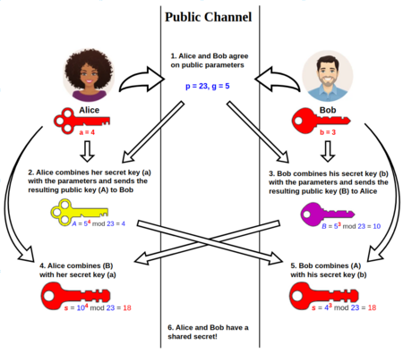
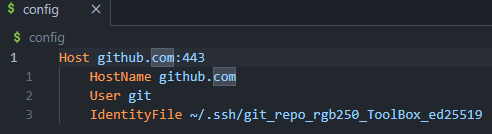

- [1. STORAGE](#1-storage)
  - [a. Memory basic](#a-memory-basic)
    - [Primary Memory](#primary-memory)
      - [Secondary Memory](#secondary-memory)
      - [Other memories](#other-memories)
    - [a. Random Access Memory](#a-random-access-memory)
- [To know the memory usage on UNIX:](#to-know-the-memory-usage-on-unix)
- [SELECT FILES](#select-files)
- [SEARCH INSIDE FILES](#search-inside-files)
- [REGEX](#regex)
- [PRINT](#print)
- [INTERNET CONNECTION](#internet-connection)
  - [Assess internet connection quality](#assess-internet-connection-quality)
  - [(Secure SHell Protocol) SSH](#secure-shell-protocol-ssh)
    - [Purpose](#purpose)
    - [Public-key cryptography](#public-key-cryptography)
  - [How to produce them](#how-to-produce-them)
- [SEARCH OVER FILES](#search-over-files)
- [SEARCH IN FILES](#search-in-files)
- [Replace string in files](#replace-string-in-files)
- [Process Information](#process-information)
  - [Zip a list of files](#zip-a-list-of-files)
- [Coding](#coding)
  - [Count number of new lines in a given text](#count-number-of-new-lines-in-a-given-text)
  - [Loop over an array](#loop-over-an-array)

# 1. STORAGE 
## a. Memory basic
### Primary Memory
It refers to all memories directly accessible by the Central Process Unit via data bus.
For technological and economical purposes there are different forms of primary memory.
- Random Access Memory: used to store the data, it is the fastest and more expansive memory.
- Dynamic RAM: each memory cells contains one transistor and one capacitor, that can store 1 bit of data. Once a cell lose its charge, the data stored is lost in less than a thousandth of a second. Then it must be refresh thousand of times per second that consumes processor resources.
- SRAM: used in specialized applications, it consists of flip-flops storing 1 bit in each cell. Unlike DRAM it does nee to be refreshed it keeps its bit until the power supply is turned on. It has a shorter read-write times.
- ROM (Read-Only-Memory): data for ROM storage is written during the production process, then only data that does not need to change such as computer's booting sequence or algorithmic tables for mathematical applications. Since ROM is slower that RAM it is less expensive.
- PROM (Programmable ROM): ROM being able to be programmed by  special hardware unit name PROM programmer. 
- EPROM (Erasable Programmable ROM): EPROM's may be erased and then programmed thanks to ultraviolet rays or electric impulse (easier and safer)
- *Cache Memory*: store certain data and instructions in cache memory, it is a piece of high-speed volatile memory. SRAM are used to make cache memory. When CPU needs data or instructions it search first in cache. A cache hit occurs when data or instructions are found in the cache.


#### Secondary Memory
- HardDisk
- CD
- DVD
- Floppy Disk

#### Other memories
- Buffer Memory: region of memory used to temporarily hold data while it is being moved from one place to another. Usually buffers are implemented in software, and are used when the ratio between the rate of which data is received and the rate at which it can be processed is too low.
- Swap Memory: the amount of memory borrowed to secondary memory by the primary memory whenever RAM runs out of memory. It stores inactive process.
- Shared Memory: memory accessible by multiple programs to provide communication between them or avoid redundant copies.
### a. Random Access Memory
```bash
free -h  # display memory information in adapted unity.
```
Here an example of output :


Remember that typically a buffer like cache 
    - *primary* memory: most known as **Random Access Memory**, this segment of computer memory directly reachable by Central Processing Unit.
    - *secondary* memory: usually named as *Disk memory*, data inside is first loaded in Random Access Memory then sent to Process Unit.             
    - *cache* memory: as access to RAM is in few microseconds but the CPU can perform operations in nanoseconds, it stores frequently accessed data.
    - *buffer* memory: 
Both allow to release some space of the data treated by the CPU.


# To know the memory usage on UNIX:

````bash
df -h # disk filename command, with the human readable option (adapt the figures of each filesystem)
du -h -d 1 ./folder_path | sort -h # to see the size of each elements in a given repository with a depth of 1 and sorted by size 
````


# SELECT FILES
````bash
ls -lh !(file_name_1|file_name_2) ./fold  # select all files in the directory <fold> except file_name_1 and file_name_2.
````
# SEARCH INSIDE FILES

grep --exclude=\*.{pyc,log} -rl './' -e ".*10\.214\.82\.92.*" # find in the current directory and its subdirectorires all the files containing the string "10.214.82.92" inside a 
grep --exclude-dir=folder_e --include=*.tex -lri monte ./* # find all files except in folder_e containing at least one occurence of "monte" inside it 

# REGEX
In *sed* system we have to escape characters like '{' or '}'
Expression like '\d' or '\w' does not exist in basic bash.
|Operator|Effect|
|---|---|
|.|Matches any single character|
|?|Preceding item is optional and will be matched at least one|
|*|Preceding item will be matched zero or more times|
|+|Preceding item will be matched one or more times|
|\b|Matches the empty string at the edge of a word|
|\B|Matches the empty string NOT at the edge of a word|
|\<|Matches the empty string at the beginning  of a word|
|\>|Matches the empty string at the end  of a word|
|\or|Or Condition
|\( \)| Start End of group
|\< \>| Start End of word


# PRINT
```bash
echo "${PATH//:/$'\n'}"  # in $PATH replace each ':' with '\n'
# note that second '/' indicates replacing all occurrences
echo "${PATH//:/$'\n'}" > path_file  # to write the content in a file <path_file>
```

# INTERNET CONNECTION
## Assess internet connection quality
Use **speedtest-cli**
```bash
sudo apt install speedtest-cli  # downloads the package
speedtest-cli --secure
```
## (Secure SHell Protocol) SSH
### Purpose
To **use network services securely** over an *unsecured network*, by encrypting content of
the transmission from an observer between 2 servers.

### Public-key cryptography
SSH uses Public-key-cryptograph, a cryptography paradigm relying on the use of 2 distinct keys:
- one ``public`` key
- one ``private`` key

They are generated with cryptographic algorithms based on mathematical problems called *one-way
function*\
One representative algorithm of public-key protocol is *Diffie-Hellman* summarized by the below 
image:\
\
What is relevant to note is that Alice and Bob **arrive to a common secret key without passing
the common secret key across the public channel**.

## How to produce them
- In ``~/.ssh`` folder create a file named ``config``
- Create both the public and private key:
    ````bash
    ssh-keygen -t <type_of_key> -C "commentary about the key's purpose"  # "ed25519" is very popular
    ````
- Then edit config like this for exemple:\
    
    Many more arguments can be added.

# SEARCH OVER FILES
```bash
find /dir_path -regextype sed -regex ".*/regex"  # search of "sed" type, ".*/" is fundamental! 
```

# SEARCH IN FILES
```bash
grep --color --include=.py -rl -iE '<regex_pattern>'  # display the list of .py files located in the curent directories and its child directories containing <regex_pattern>
```
use ``--color=always`` for grep use inside a pipeline, if it is with ``less`` and add
``-r``.
```bash
grep --color=always --include=.py -rl -iE '<regex_pattern>' | less -r
```

# Replace string in files
```bash
sed -i -e 's/to_replace/replacement/g' ./path_file  # -i --> --in-place
# -e --> --expression, consider the expression just after as a script
```


# Process Information
```bash
ps aux  # ps aux --> a: process of all users, u: process's users/owner x: process not attached to a terminal 
ps aux | sed -n "1p; /<regex_word>/p"  # to search for a given regular expression while keeping the header.
cat /proc/<PID>/cmdline  # provide the command line that called the process <PID>
# Run process in the background --> use ampersand symbol (&)
vlc > /dev/null 2>&1 &  # >/dev/null 2>&1 means stdout --> /dev/null and stderr --> stdout
jobs -1  # displays the status of all stopped and background jobs in the current session
fg  # bring a process to the foreground
bg  # bring a process to the background
nohup vlc &  # nohup ignore all SIGHUP (hangup) signals, sent when terminal is closed
```

## Zip a list of files
````bash
find -type f -regex 'pattern' | zip file_list.zip -@  # -@ makes zip read from STDIN
````

# Coding
## Count number of new lines in a given text
````bash
find -type f -regex '.*/pattern' | wc -l  # wc count the number of words, bits or newlines, the -l argument allows to count newlines
````
## Loop over an array
````bash
declare -a arr=(
    'fsfsd' 'fsfsff' 'mmkoi'  # create an array named arr
    )
for word in "${arr[@]}"       # loop over the value of arr
    do
        echo $word
    done
````
