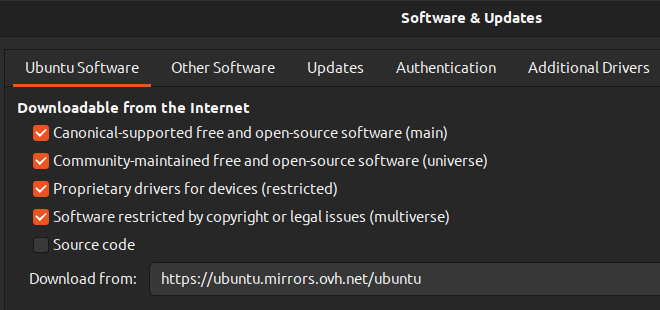
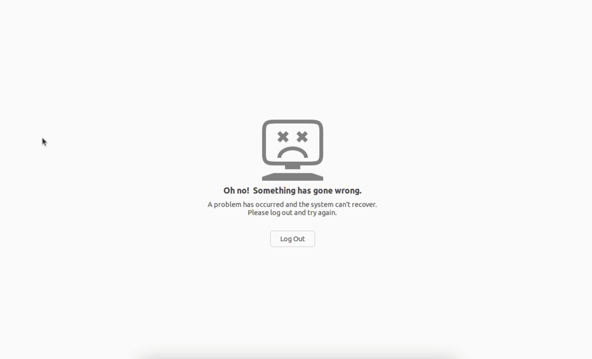

- [1) Packages](#1-packages)
  - [a. How to install/uninstall packages](#a-how-to-installuninstall-packages)
  - [b. How to check the list of packages](#b-how-to-check-the-list-of-packages)
  - [c. How to search a package in the list](#c-how-to-search-a-package-in-the-list)
  - [e. How to update and upgrade](#e-how-to-update-and-upgrade)
  - [f. Update issue:](#f-update-issue)
  - [g. Fix issues like "Oh no"](#g-fix-issues-like-oh-no)
- [2) System](#2-system)
  - [a. Update and upgrade](#a-update-and-upgrade)
  - [b. Hide home icon](#b-hide-home-icon)
- [3) Compressed files](#3-compressed-files)
- [4) Networks](#4-networks)
  - [a. Speedtest from](#a-speedtest-from)
- [5 File system](#5-file-system)
  - [a. /opt](#a-opt)
- [6 Environment Variables](#6-environment-variables)
  - [a. $PATH](#a-path)
- [7 Text editor](#7-text-editor)
  - [a. Vim](#a-vim)
    - [Navigating](#navigating)

# 1) Packages
## a. How to install/uninstall packages
- Deb
```bash
sudo dpkg -i package_deb  # dpkg --> Debian Package Management System
sudo dpkg -P package_deb  # P for purge to remove config files as well
```
- Snap
```bash
sudo snap install package_snap  # install
sudo snap remove package_snap   # remove
```
- Apt
```bash
sudo apt-get remove package_snap  # install 
sudo apt-get  package_snap        # remove
```
## b. How to check the list of packages
- Apt-get
    ```bash
    apt list --installed  # list of packages installed through apt-get
    ```
- Snap
    ```bash
    snap list  # list of snap packages
    ```
## c. How to search a package in the list 
- Apt-get
    ```bash
    apt-cache search <keyword>  # search for all packages containing <keyword>
    ```
- Snap
    ```bash
    snap search <keyword>  # search for all packages containing <keyword>
    ```
## e. How to update and upgrade
- Apt-get
```bash
sudo apt-get update && sudo apt-get upgrade  
```
- Snap 
```bash
sudo snap refresh
```
## f. Update issue:
``E: The repository 'http://mirror.serverius.net/ubuntu jammy Release' no longer has a Release file.``\\
We can fix this issue by going on "Software & Updates", then in "Ubuntu Software" window changing the value of "Download from":

Check the effectiveness in ``/etc/apt/sources.list``

## g. Fix issues like "Oh no"


This can be fix with, by firstly typing ``CTRL + F3``, then:
````
sudo apt-get update && sudo apt-get dist-upgrade
sudo apt-get clean && sudo apt-get autoremove && sudo reboot
````
# 2) System 
## a. Update and upgrade
When LTS (Long Term Support) are available follow the steps bellow:
````bash
sudo apt-get update && sudo apt-get upgrade -y  # updates and upgrades packages
sudo apt-get dist-upgrade                       # does same and handle dependencies withe new packages
sudo do-release-upgrade                         # update os to latest release
````

## b. Hide home icon
````bash
gsettings set org.gnome.shell.extensions.ding show-home false
````


# 3) Compressed files
- ``tar.gz`` files
    ```bash
    tar -xvzf <compressed_file_name>.tar.gz  
    # x --> collect and extract,
    # v --> verbose,
    # z --> tells tar to decompress the archive using gzip,
    # f --> tells tar the path of the compressed file
    ```


# 4) Networks
## a. Speedtest from 
```bash
speedtest
```

- Latency: measures how quickly the device gets a response after one somebody has sent out a request.
- ISP (Internet Service Provider): company providing internet access.
- Idle
    - ``Latency``: test measuring the response on the network when it is not in use.
    - ``Download``: latency is measured while the download test is in progress to see how it is affected by the download activity on the network.
    - ``Upload``: latency is measured while the upload test is in progress to see how it is affected by the upload activity on the network.

# 5 File system
## a. /opt
Folder in which to install add-on applications

# 6 Environment Variables
## a. $PATH
```bash
export PATH="</path/to/add>:$PATH"  # to add the folder "/path/to/add" to the environment variable $PATH
```
Doing this in terminal will just remain effective as long as the session is open, to add it permanently we have to add it in ``~/.bashrc`` file, then source it.  

# 7 Text editor
## a. Vim
### Navigating
- Go to a position, then type ``Ctrl + o`` to go back to the initial previous position, you can
type ``Ctrl + i`` to go forth this time.
- For the last change location ``g,`` and newer ``g;`` finally the last location where Insert 
Mode has been used: ``gi``