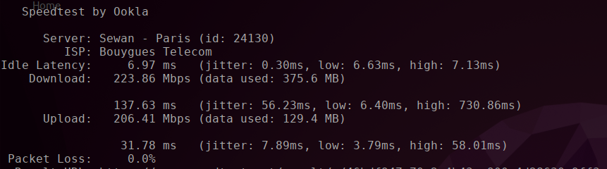

# 1) Packages
## a. How to install/uninstall packages
- Deb
```bash
sudo dpkg -i package_deb  # dpkg --> Debian Package Management System
sudo dpkg -P package_deb  # P for purge to remove config files as well
```
- Snap
```bash
sudo snap install package_snap  # install
sudo snap remove package_snap   # remove
```
- Apt
```bash
sudo apt-get remove package_snap  # install 
sudo apt-get  package_snap        # remove
```
## b. How to check the list of packages
- Apt-get
    ```bash
    apt list --installed  # list of packages installed through apt-get
    ```
- Snap
    ```bash
    snap list  # list of snap packages
    ```
## c. How to search a package in the list 
- Apt-get
    ```bash
    apt-cache search <keyword>  # search for all packages containing <keyword>
    ```
- Snap
    ```bash
    snap search <keyword>  # search for all packages containing <keyword>
    ```
## e. How to update and upgrade
- Apt-get
```bash
sudo apt-get update && sudo apt-get upgrade  
```
- Snap 
```bash
sudo snap refresh
```
# 2) Compressed files
- ''tar.gz'' files
    ```bash
    tar -xvzf <compressed_file_name>.tar.gz  # x --> collect and extract,
    v --> verbose, z --> tells tar to decompress the archive using gzip,
    f --> tells tar the path of the compressed file
    ```


# 3) Networks
## a. Speedtest from 
```bash
speedtest
```

- Latency: measures how quickly the device gets a response after one somebody has sent out a request.
- ISP (Internet Service Provider): company providing internet access.
- Idle
    - ``Latency``: test measuring the response on the network when it is not in use.
    - ``Download``: latency is measured while the download test is in progress to see how it is affected by the download activity on the network.
    - ``Upload``: latency is measured while the upload test is in progress to see how it is affected by the upload activity on the network.

# 4 File system
## a. /opt
Folder in which to install add-on applications

# 5 Environment Variables
## a. $PATH
```bash
export PATH="</path/to/add>:$PATH"  # to add the folder "/path/to/add" to the environment variable $PATH
```
Doing this in terminal will just remain effective as long as the session is open, to add it permanently we have to add it in ``~/.bashrc`` file, then source it.  