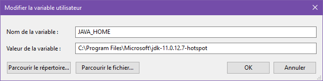

# Glossary

- **C**
  - *Corpus*: a set of documents.
- **D**
  - *Document*: a string of variable length, from a few words to a book.
  - *Downstream tasks*: pre-trained models are trained on general datasets and then learn
  general knowledge, the downstream tasks are the the target tasks that you want to solve by
  combining general then specific training.

# Data Sets

## GLUE (General Language Understanding Evaluation)

It is a collection of ressources for training, evaluating, and anylyzing 

## MultiNLI (Multi-genre Natural Language Inference)

It is a collection gathering nearly 433k sentence pairs annotated with textual entailment
information

## SQuAD (Stanford Question Answering Dataset)

Set of questions asked by crowdworkers on a set of Wikipedia article and the answer to every
question is a segment of text or span.

# Elementary algorithms

## TF-IDF (Term Frequency-Inverse Document Frequency)

### Purpose

The aim is to be able to quantify the "relevancy" of a given word.\
The TF-IDF is the product of 2 statistics, ``term frequency`` and ``inverse document
frequency`` that can be defined in various ways.

### Theory

- ``term frequency``: consider a term $t$ in a document $d$ and $f_{t,d}$ the count of $t$ in
$d$, it is the relative frequency defined by:\
$tf(t,d) = \frac{f_{t,d}}{\displaystyle\sum_{t'\in d}f_{t',d}}$.
- ``inverse document frequency``: aims to assess the amount of information that a given term
$t$ carries, for a given corpus $D$ of document $d$:\
$idf(t,D) = \log\left(\dfrac{\lvert D\rvert}{\lvert\left\{d: d\in D \wedge t\in d\right\}\rvert}\right)$

The Shannon entropy of a *randomely chosen* document in the corpus $D$ containing $t$ is:\
$H(D|t) = -\displaystyle\sum_{d\in D}\mathbb{P}\left(d|t\right)\times\log\left(\mathbb{P}\left(d|t\right)\right)$

### Link with information theory

Let's assume that the unit probability of finding in a corpus $D$ a document $d$ containing the
term $t$ is defined by:\
$\mathbb{P}\left(d|t\right) = \dfrac{1}{\lvert\left\{d\in D \wedge t\in D\right\}\rvert}$

# BERT (Bidirectional Encoder Representation from Transformers)

## Introduction

Language model pre-training has been shown to be effective already around 2015 for
sentence-level tasks (natural language inference), paraphrasing (aiming to predict the
relationships between sentences) or token-level tasks (named entity recognition and
question-answering).\

To apply pre-trained language representations to downstream tasks there are 2 strategies:

- ``feature-based``: uses task-specific architectures including the pre-trained representations
as additional features (e.g. ELMo)
- ``fine-tuning``: introduces minimal task-specific parameters, and is trained on the
downstream tasks by simply fine-tuning all pre-trained parameters (e.g. GPT)

While the above approaches use ``unidirectional`` language model for fine-tuning preventing
to them to represent the whole context, before as well as after a given word, BERT uses
``*bidirectional*``  language model allowing to enrich the context representation of a word
with elements before and after this word.

# NLTK (Natural Language Tool-Kit)

## Introduction

Its interest is its flexibility compared to SpaCy, for conventional work we should use SpaCy 

## Download the necessary materials

We have to download ``punkts`` (lists of items) which is a tokenizer dividing text into list of
sentences by using an unsupervised algorithm to build a model for *abbreviation words*,
*collocations* and *words that start sentences*.

````python
import nltk
nltk.download('punkt')
````

Otherwise clone the repository [https://github.com/nltk/nltk_data/tree/gh-pages](https://github.com/nltk/nltk_data/tree/gh-pages).

Create a new folder in the location of your choice, then store the path of this new folder in
``NLTK_DATA`` environment variable.\
For example if you want 'install' *punkt* component, you have to create a sub-folder
``tokenizers`` in the created folder then unzip ``packages\tokenizers\punkt.zip`` in the
created sub-folder.
From now to install a given package you can replicate folders of the concatenate files in me.

For future installations, you just have to *pull* the last changes in the git repository.

## String comparison

### Extend tag capabilities with Standford ressources

NLTK handles English and Russian, for French for example we can use a model from Stanford.
We can follow the below steps:

- Adding the grand-father folder of java executable file to the environment variables with the
name: ``JAVA_HOME``\
  \
  In the above architecture the executable file path is
  *C:\Program Files\Microsoft\jdk-11.0.12.7-hotspot\java.exe*
- Download the Stanford materials at: [https://nlp.stanford.edu/software/tagger.html](https://nlp.stanford.edu/software/tagger.html)
- Identify:
  - tagger model, for exemple *french-ud.tagger*
  - tagger file named like *stanford-postagger-4.2.0.jar*
- implement a code like below:

  ````python
  from nltk.tokenize import word_tokenize
  from nltk.tag import StanfordPOSTagger

  path_model = os.path.abspath(r"C:\Users\GBENOU\AppData\Local\stanford-postagger-full-2020-11-17\models\french-ud.tagger")
  path_tagger_file = os.path.abspath(r"C:\Users\GBENOU\AppData\Local\stanford-postagger-full-2020-11-17\stanford-postagger-4.2.0.jar")
  tagger_stanford = StanfordPOSTagger(path_model, path_tagger_file)
  tagger_stanford.tag(word_tokenize("par delà l'univers"))
  ````

### Chuncking

- regex
- tree
- name entity recognition

### Sentence Structuring

## Locality-Sensitive Hashing (LSH)

### Aim

It **gather similar items** into the same bucket *with high probability*.

### Advantages

- Reduce the dimensionality by grouping similar items
