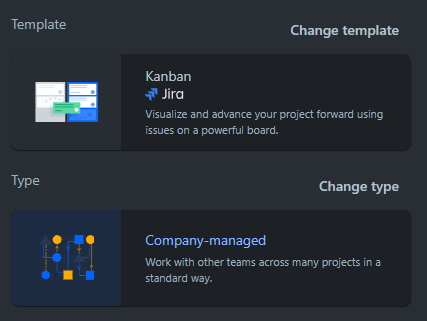
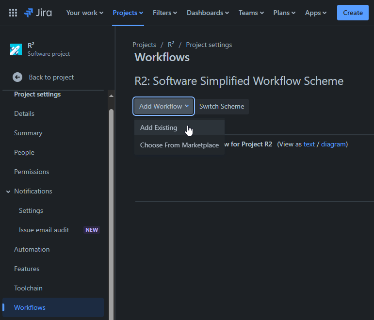
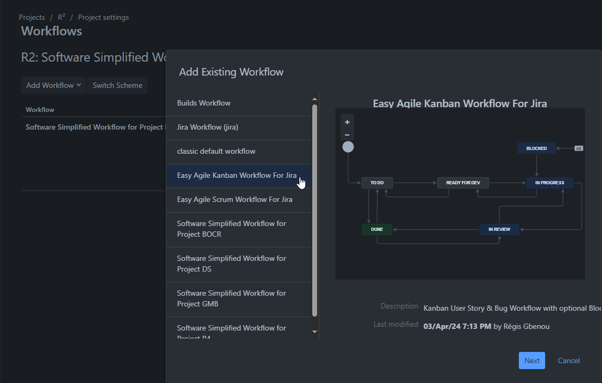
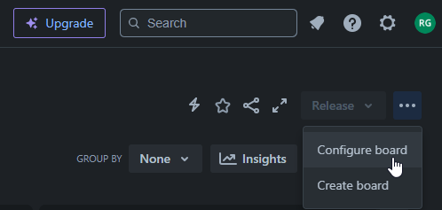
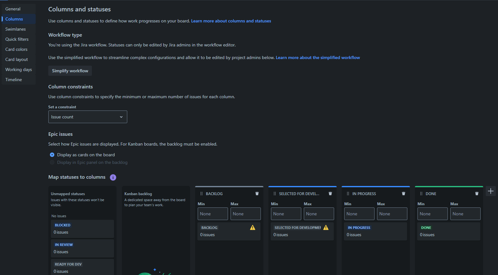
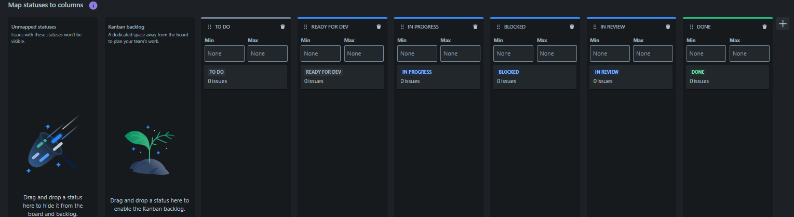

- [Altassian](#altassian)
  - [Introduction](#introduction)
  - [Trello](#trello)
    - [Key features](#key-features)
    - [How to use it](#how-to-use-it)
  - [Jira Software](#jira-software)
    - [Key features](#key-features-1)
    - [How to use it](#how-to-use-it-1)
    - [Create Project](#create-project)
    - [Create Workflow](#create-workflow)
    - [Configure Board](#configure-board)
    - [Issue layout](#issue-layout)

# Altassian

## Introduction
- Trello
    - used for all teams across an organization
- Jira
    - Work Management edition: for business teams to collaborate and deliver with
    automation features
    - Software edition: for software teams working in agile
    
## Trello

### Key features

- Views: Timeline, Calendar, Dashabooard, Map View
- Power-Ups: possibility to embed Google Drive, Jira ...
- Automation: record a set of repetitive commands and run it

### How to use it

- Individual work management: set reminder, record notes and manage smaller-scale 
projects
- Private team collaboration: support daily standups, 1:1 meetings
- Synchronous team activities: useful for brainstorming
- Large scale tracking: Trello boards
- Tema culture activities: spaces to store ressource hubs

## Jira Software

### Key features

- Boardsd: different agile methodologies mainly Scrum Kanban
    - Scrum $\rightarrow$ break uup larger projects in smaller ones
    - Kanban $\rightarrow$ visualize workflows
- Roadmaps: full visibility into project progress across multiple teams and sprints
- Advanced reporting: agile reports dashboards, chart graphs
- Change management: prepare test and control rollouts

### How to use it 

- Agile workflow management: Scrum, DevOps and Kanban
- Bug tracking: Monitor track assign
- Collaboration across dev teams and organization-wide: manage work across dev teams
from DevOps to QA
- Reporting: deliver updates on teh progress of key initiatives

### Create Project

- Go to *Create Project > Software development > Kaban > Use template > Select a company-managed project*
  - You will have something like:
  
- Provide Name and Key

### Create Workflow

- Chose a workflow\
  
- The ``Easy Agile Kanban Workflow For Jira`` is quite performant\
  

### Configure Board

- Go to the board setting
  - 
- Then customize as you wish
  - 
- Fix default assignment, by creating columns with the correct name, like this:
  - 

### Issue layout

- Click on an issue then ``Configure``