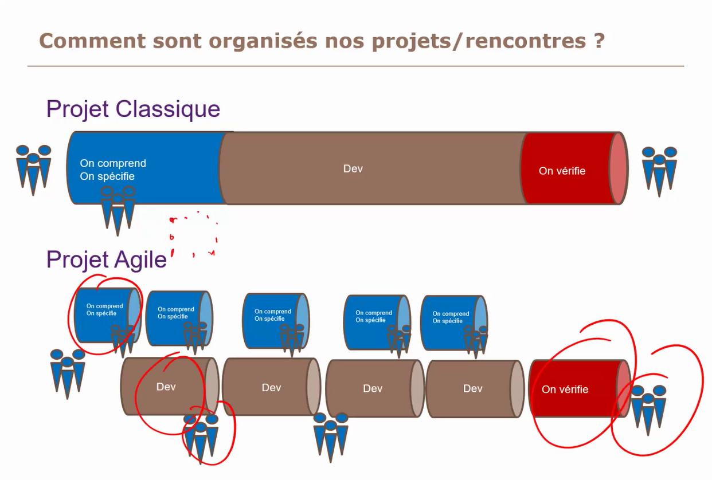
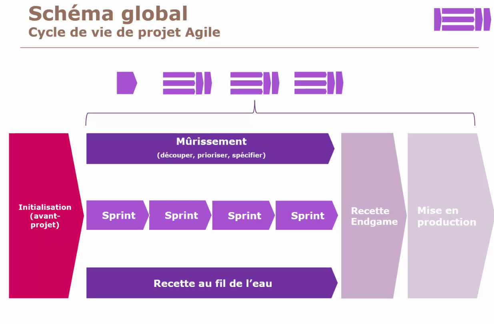
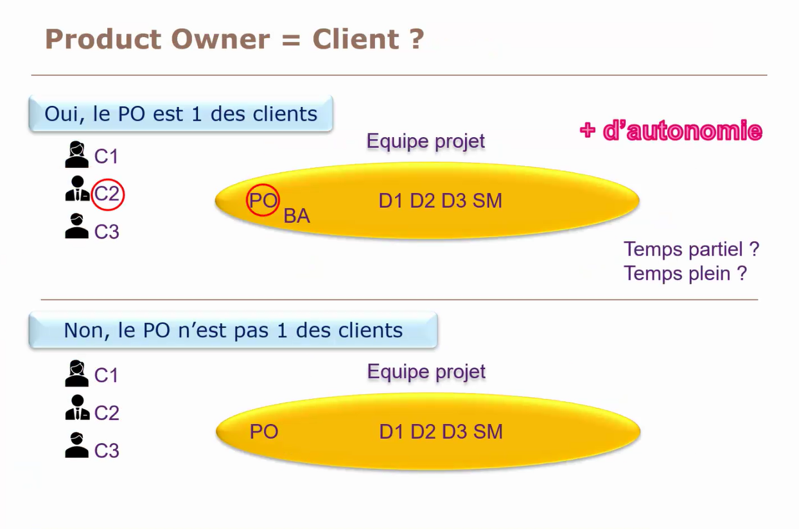
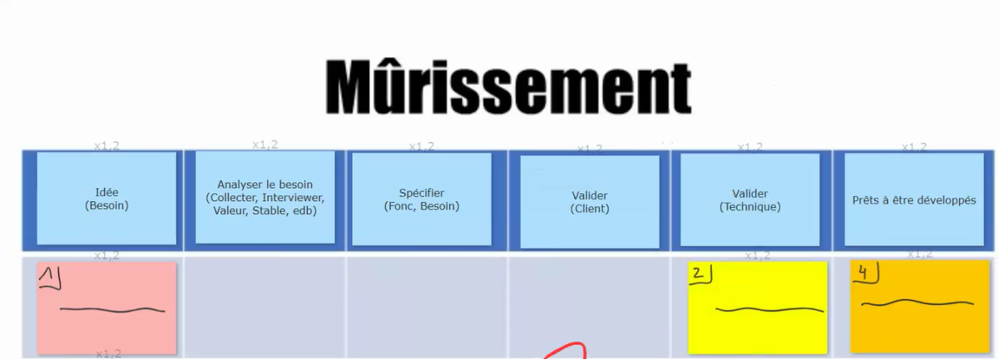
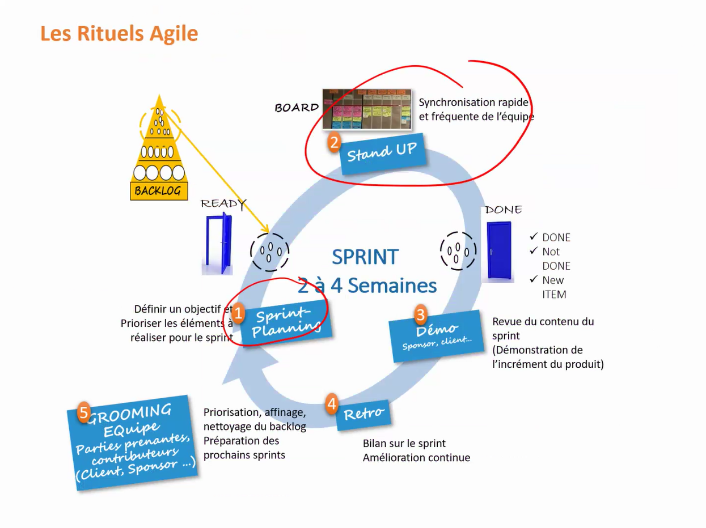
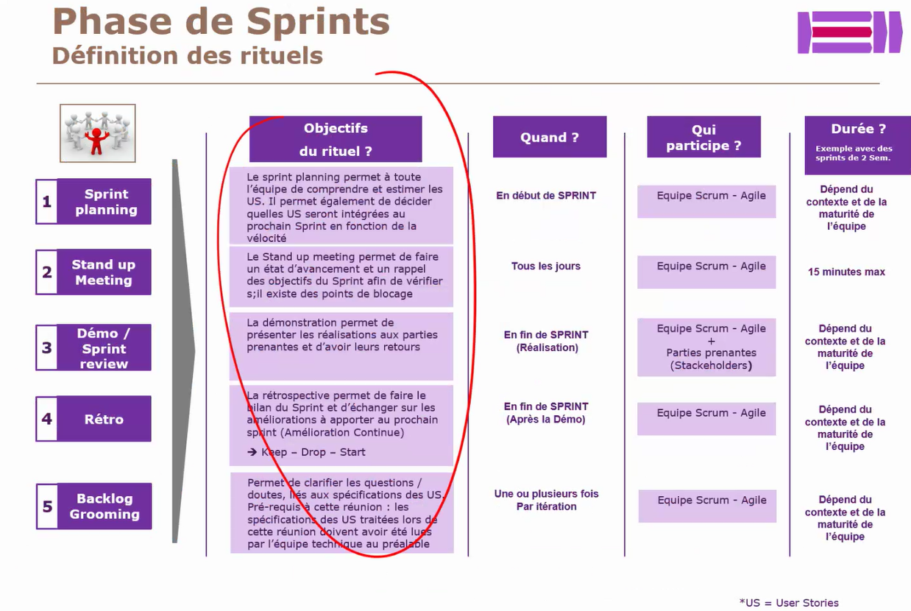

- [Altassian](#altassian)
  - [Introduction](#introduction)
  - [Trello](#trello)
    - [Key features](#key-features)
    - [How to use it](#how-to-use-it)
  - [Jira Software](#jira-software)
    - [Key features](#key-features-1)
    - [How to use it](#how-to-use-it-1)
    - [Create Project](#create-project)
    - [Create Workflow](#create-workflow)
    - [Configure Board](#configure-board)
    - [Issue layout](#issue-layout)
- [Agile](#agile)
  - [Gloassary](#gloassary)
  - [Projects](#projects)
  - [Roles](#roles)
  - [Backlog](#backlog)
  - [Cérémonies](#cérémonies)
    - [Sprint planning](#sprint-planning)
    - [Daily](#daily)
    - [sprint review](#sprint-review)
    - [Sprint retrospective](#sprint-retrospective)

# Altassian

## Introduction
- Trello
    - used for all teams across an organization
- Jira
    - Work Management edition: for business teams to collaborate and deliver with
    automation features
    - Software edition: for software teams working in agile
    
## Trello

### Key features

- Views: Timeline, Calendar, Dashabooard, Map View
- Power-Ups: possibility to embed Google Drive, Jira ...
- Automation: record a set of repetitive commands and run it

### How to use it

- Individual work management: set reminder, record notes and manage smaller-scale 
projects
- Private team collaboration: support daily standups, 1:1 meetings
- Synchronous team activities: useful for brainstorming
- Large scale tracking: Trello boards
- Tema culture activities: spaces to store ressource hubs

## Jira Software

### Key features

- Boardsd: different agile methodologies mainly Scrum Kanban
    - Scrum $\rightarrow$ break uup larger projects in smaller ones
    - Kanban $\rightarrow$ visualize workflows
- Roadmaps: full visibility into project progress across multiple teams and sprints
- Advanced reporting: agile reports dashboards, chart graphs
- Change management: prepare test and control rollouts

### How to use it 

- Agile workflow management: Scrum, DevOps and Kanban
- Bug tracking: Monitor track assign
- Collaboration across dev teams and organization-wide: manage work across dev teams
from DevOps to QA
- Reporting: deliver updates on teh progress of key initiatives

### Create Project

- Go to *Create Project > Software development > Kaban > Use template > Select a company-managed project*
  - You will have something like:
  
- Provide Name and Key

### Create Workflow

- Chose a workflow\
  
- The ``Easy Agile Kanban Workflow For Jira`` is quite performant\
  

### Configure Board

- Go to the board setting
  - 
- Then customize as you wish
  - 
- Fix default assignment, by creating columns with the correct name, like this:
  - 

### Issue layout

- Click on an issue then ``Configure``

# Agile

## Gloassary

Client centric: get customer closer to project
Maturation: compréhension du besoin
Sprint: morceaux de développement (1 à 4 semaines) 
Scrum master: person that garants the application of Agile rules, teach, organize meeting, 
and act as a shield
Agile master: scrum master on multiple projects
Product Owner: person that garants that customer needs are correctly understood by the teams

## Projects

Sprints allows to assess the capacity of the team to progress on a task, as well as to f
reachable goals

In agility we prevent to mature projects that we are not sure to work on in the following 
2 months, I prioritize depending on the plan

It is not useful to put in production the results at the end of each sprint 

We can do a constant check of sprints to be sure that they are in line with what we want

## Roles

Product Owner roles:

- customer relationship
- customer collection
- needs prioritization
- functional specifications
- share customer needs to the team

There are 2 types of PO, one being a customer (~15%) and another being from the production
team (~85%).
In the first case the strenght is in the business knowledge but from a developer side it
gets difficult that's why it is encouraged to call a business analyst

## Backlog

Backlog pour le product owner et du scrum master,  
Il faut le challenger
But clair à chaque backlog (expliciter un objectifs fonctionnel défini)
La longueur d'un sprint dépend de l'objectif défini pour un sprint donnée

## Cérémonies

### Sprint planning

Avec tout le monde
La première réunion du sprint, penser à préparer la backlog du sprint s + 1

- Sprint Backlog: Echanger avec le product owner et l'équipe pour valider la backlog
- Prévision du travail nécessaire pour chaque tâche  Poker planning: Sur chaque tâche échanger avec les membres l'équipe pour découper et calculer une complexité

### Daily
- Faire l'état des tâches ne pas 

### sprint review
Echange avec les parties prenantes et faire une présentation des travaux réalisé
1H/2H

### Sprint retrospective
L'équipe explique ce qui s'est bien et mal passé y dégager un plan d'action (1H/2H)

Penser à y insérer des pauses en fin de sprint (1 à 2 jours)

Nettoyer le 

