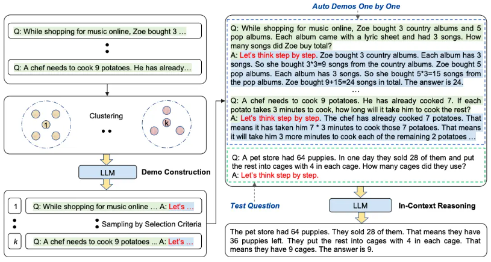

# Prompt techniques

## ``Zero-shot``

A request without knowledge provided, the model will try to figure out by itself.\
Useful for testing.

## ``Few-shot``

We provide a few example to explain the task to the model.

## ``Chain-of-thought`` (CoT)

In this approach we will ask to the LLM to produce results step by step.

### CoT + Zero-shot

It has been noticed that we can achieve the same results in combining Few-shot and CoT approach
than in using Zero-shot and CoT.

### Automatic CoT

We can use CoT + Zero-shot to produce examples then use them to produce the desired output:

