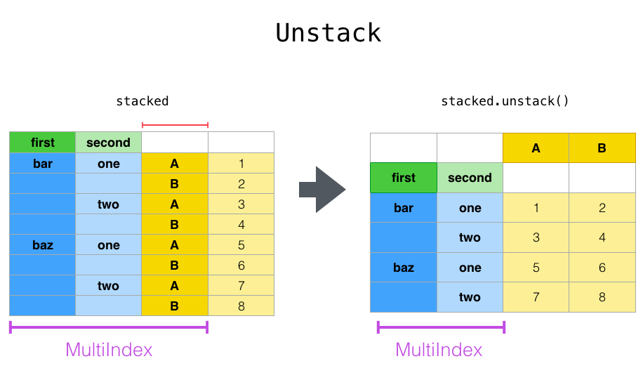

- [Multi-index](#multi-index)
- [Concatenate](#concatenate)
- [Display in Jupyter](#display-in-jupyter)
- [Combining overlapping data frames](#combining-overlapping-data-frames)
- [Chaining](#chaining)
- [Transforming data](#transforming-data)
- [Summarizing data](#summarizing-data)
- [Selecting](#selecting)
- [Merge Join](#merge-join)
- [Pyspark](#pyspark)
  - [Installation](#installation)
  - [Apache Arrow](#apache-arrow)

# Multi-index
```python
import pandas as pd

df = pd.DataFrame(np.random.random((4, 4)))
df.columns = pd.MultiIndex.from_product([[1, 2], ['A', 'B']])
""""
  +===============+==============+
  |       1       |       2      |
  +---------------+--------------+
  |   A   |   B   |  A    |  B   |
  +=======+=======+=======+======+
0 | 0.544 | 0.628 | 0.757 | 0.7  |
  +-------+-------+-------+------+
1 | 0.633 | 0.896 | 0.198 | 0.784|
  +-------+-------+-------+------+
2 | 0.662 | 0.541 | 0.544 | 0.059|
  +-------+-------+-------+------+
3 | 0.841 | 0.635 | 0.815 | 0.848|
  +=======+=======+=======+======+ 
"""

df.iloc[:, df.columns.get_level_values(1) == 'A']
"""
  +===============+
  |   A   |  A    |
  +=======+=======+
0 | 0.544 | 0.757 |
  +-------+-------+
1 | 0.633 | 0.198 |
  +-------+-------+
2 | 0.662 | 0.544 |
  +-------+-------+
3 | 0.841 | 0.815 |
  +=======+=======+ 
"""
```

# Concatenate
```python
import pandas as pd

df = pd.read_csv('path_of_a_csv_file')
list_cols_to_concatenate = list(df.iloc[:, 1:4])
df[‘concatenated_cols’] = df[list_cols_to_concatenate].astype(str).agg(‘-’.join, axis=1)
```

# Display in Jupyter

```python
import pandas as pd
from IPython.display import display
with pd.option_context('display.max_rows', 100, 'display.max_columns', 10):
    display(df)
```

# Combining overlapping data frames
When we have 2 data frames, in which the first one has high data quality containing 
missing values, and the second lower data quality.
The idea would be to take data from the first data frame by default and complete we the 
second one.
```python
import numpy as np
import pandas as pd

df1.combine_first(df2)  # <df1> is the data frame of higher data quality
df1.combine(df2, lambda x,y: np.where(pd.isna(x)), y, x)  # combine method is more general
```


# Chaining
Use of chaining is encouraged by Pandas community, this done through ``pipe()`` method.
```python
import statsmodels.formula.api as sm

bb = pd.read_csv("data/baseball.csv", index_col="id")
(
    bb.query("h > 0")
    .assign(ln_h=lambda df: np.log(df.h))                    # create a new column
    .pipe((sm.ols, "data"), "hr ~ ln_h + year + g + C(lg)")  # <"data"> indicates to consider the above result as <data> argument in <sm.ols function>
    .fit()
    .summary()
)
```

# Transforming data
- ``apply()``: like a for loop
- ``map()``: element-wise apply
- ``transform()``: apply function directly, to multiple columns
- ``agg()``: summary

# Summarizing data
A flexible way to do it is:
````python
df.groupby(['dim1', 'dim2'], keep_group=True).agg(  # if we want to keep the grouping dimensions
  new_name1=pd.NameAgg(column='value1', aggfunc="mean"),
  new_name2=pd.NameAgg(column='value2', aggfunc="count")
)
````

# Selecting 
- hard methods
  - ``at[]`` or ``iat[]``: scalar value (very efficient)
  - ``loc[]`` or ``iloc[]``: for value
- boolean methods
  - ``isin()``
  - ``where()`` or ``mask()`` which is the inverse of where()
  - ``query()``: useful when we apply the same filtering to a set of data frames.
  
# Merge Join 

- Pivot
  
- Stack
  
- Unstack
  
  
- Melt
  

# Pyspark

## Installation

````bash
pip install pyspark
pip install pyspark[sql]  # to use PyArrow
````

## Apache Arrow

It is an ``in-memory columnar data format`` used in Spark to efficiently transfer data between
JVM and Python processes.