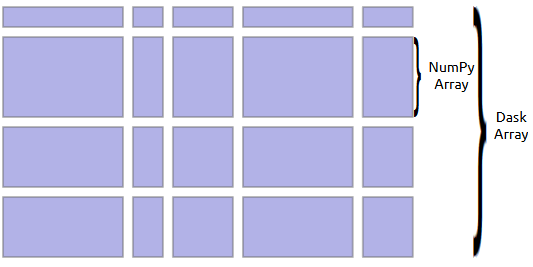

- [Multiprocessing](#multiprocessing)
  - [Introduction](#introduction)
- [Dask](#dask)
  - [Introduction](#introduction-1)
    - [Purpose](#purpose)
    - [Package to install with](#package-to-install-with)
  - [Data Ingestion](#data-ingestion)
  - [Deploy Dask Clusters](#deploy-dask-clusters)
    - [Local](#local)
  - [Dask collections](#dask-collections)
    - [Dask Array](#dask-array)
    - [Dask Bags](#dask-bags)
    - [Dask DataFrames](#dask-dataframes)
  - [Dask Delayed](#dask-delayed)
    - [Purpose](#purpose-1)

# Multiprocessing

## Introduction

``multiprocessing`` package offers convenient ways to spawn processes in parallel.
For example *Pool* object allows to:

- parallelizing the execution of a function across different input data
- distributing the input data across processes

# Dask

## Introduction

### Purpose

This library will split objects named ``collections`` in different *partitions*, then depending
on the instruction provided in the input function it will establish a strategy materialized by a
task graph. Finally the real computation will occur once users will ask for it.


### Package to install with

- ``graphviz``, complex installation on Windows
- ``ipycytoscape`` 
- ``nodjs``
- ``dask-labextension``: [dask-labextension](https://github.com/dask/dask-labextension)

## Data Ingestion

````python
import dask.dataframe as dd

ddf = dd.read_csv('large_file.csv', blocksize=25e6) 
````

A good rule of thumb is **working on partitions weighting less than 100MB**.

## Deploy Dask Clusters

### Local

````python
from dask.distributed import LocalCluster

cluster = LocalCluster()       # fully-featured local Dask cluster
client = cluster.get_client()
````

## Dask collections

### Dask Array

This collection coordinates many Numpy array arranged into chunks within a grid:\


````python
import dask.array as da

x = da.random.random
````

### Dask Bags

This object implements operations like ``map``, ``filter``, ``groupby`` and
*aggregation* on collections of Python objects. It can be viewed as a **parrallel
version of ``itertools``**.

Very useful to work with dictionaries.

````python
import dask.bag as db
import json

bag = db.read_text('json_file_to_read').map(json.loads)  # uses the json.loads method
bag.map(lambda record: record['occupation']).take(2)     # take() allows to select the number of first elements to consider
````

### Dask DataFrames

This object coordinates many Pandas dataframes, partitioned along an index:\

it is defined by:

- ``graph`` with a special set of keys designating partitions  
- ``name`` allowing to identify which keys in the Dask graph refer to this DataFrame
- ``empty Pandas object`` containing appropriate metadata (e.g; column name, dtypes, etc...)
- ``sequence of partition boundaries`` along the index called **division**

There are many applications:

- **Metadata**
  - Many DataFrame operations rely on knowing the name and dtype of columns. To keep track of
  this information Dask DataFrame objects have the attribute ``_meta`` which is **an empty
  DataFame with appropriate column names and dtypes**.
  - Internally, **Dask DataFrames does its best to propagate the meta information**, it is **done
  by evaluating the operation on a small sample of fake** data which can be found on the
  ``_meta_nonempty`` attribute.\
  Sometimes this operation may fail in user defined functions (e.g. when using ``apply()``), for
  these cases we should specify the metadata directly meaning avoiding the inference step by
  using ``meta`` keyword as bellow:

    ````python
    """ Imaging we want to apply a function foo() on the different partitions of ddf """
    ddf.map_partitions(
      foo,
      meta=pd.DataFrame({'a': [1], 'b': [2]})              # use a data frame mapping the name to dtype, order should be respected
      # meta={'a': np.dtype(int), 'b': np.dtype(int)}      # dictionary {name: dtype}, order is important as well
      # meta=(('a', np.dtype(int)), ('b', np.dtype(int)))  # use tuple of tuple (name, dtype)
    )
    ````

- **Partitions**
  - Each partition of the Dask DataFrame corresponds to a Pandas DataFrame, partitions are created by vertically splitting along the index the Dask DataFrame. That's why **it is highly
  recommended to work with sorted data like this expensive operations (e.g. groupby's, joins,
  etc...) can be handled in an efficient way**.

  ````python
  ddf.npartitions  # get the number of partitions of the Dask DataFrame
  ddf.divisions    # get the index of the partitions, useful if you want to use ddf.loc 
  ````

  - Usually we lack ``divisions`` information, if we need to perform operations requiring a
  cleanly partitioned DataFrame we can fix this by calling ``set_index()``

- **Optimization**
  - *Filter Pushdown*: Filters are executed in the earliest stage in the query
  - *Avoiding Shuffles*: try to avoid shuffling data between workers, this can be achieved if the
  column layout is already known meaning if the DataFrame was shuffled on the same column before.
  For example **executing a ``df.groupby(...).apply(...)`` after a merge operation will not
  shuffle the data again if the groupby happens on the merge columns**.
  - We can explore the optimized query:

  ````python
  ddf.explain()
  ````


- **Groupby**

  - by default ``groupby()`` chooses the number of output partitions based on a few different
  factors, like the number of grouping keys to guess the cardinality of your data. It is possible
  to override this behavior with argument ``split_out``

  ````python
  ddf.groupby('id').value.mean(split_out=8)     # returns 8 partitions
  ddf.groupby('id').value.mean(split_out=True)  # returns the same as df.npartitions, useful for operations that does not reduce the number of rows very much
  ````

- **Groupby Apply with Scikit-Learn**

  ````python
  from sklearn.linear_model import LinearRegression

  def train(partition):
    if not len(partition):
      return
    model = LinearRegression()
    model.fit(partition[['x']].values, partition['y'].values)
    return model

  df_agg_mod = (
    df
    .groupby('name')
    .apply(train, meta=(name='LinearRegression', dtype=object))  # Pandas will store the result as a general object
    .compute()
  )
  ````

The ``meta`` argument tells Dask how to create the DataFrame or SEries that will
hold the result of ``apply()``. Here *train()* returns a single value so *apply()*
will create a *Series*.

## Dask Delayed

### Purpose

It allows to make the  custom computations lazy, 