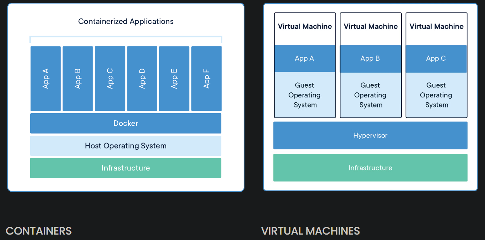
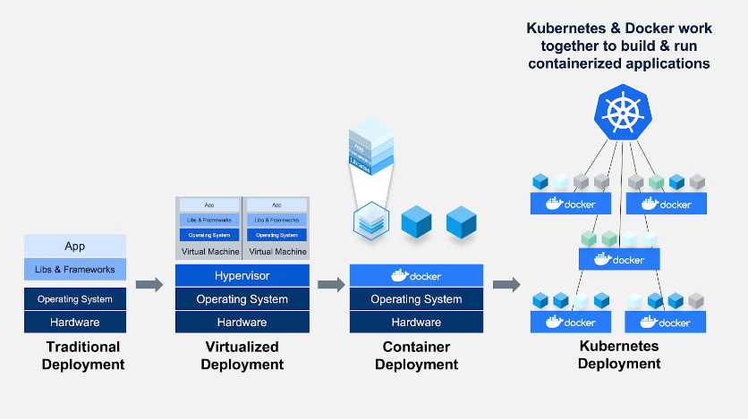

# Definition 
Set the port, intern and extern
Download an image, like linux
``Dock file`` contains a set of instructions

# What are containers ?

## In some words

They are an abstract layer at level of application, and allow to package code 
and dependencies together.

## Different from virtual machines

## Differences with Kubernetes

# Kubernetes 

## Deployments

### 